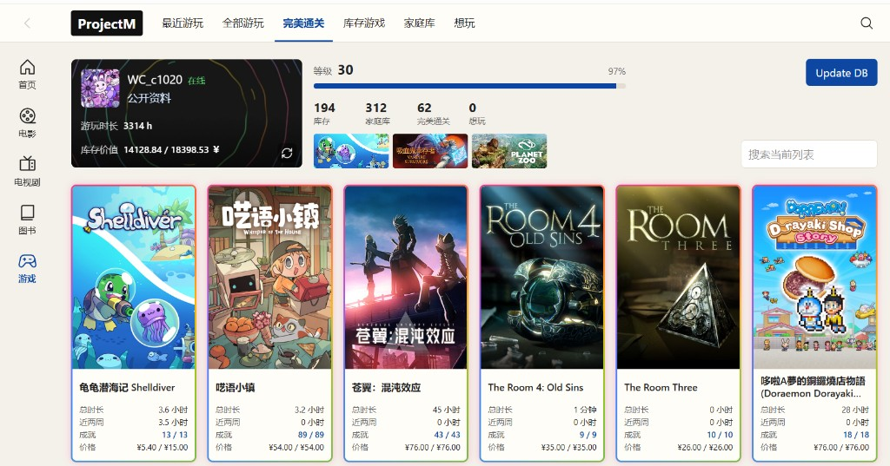
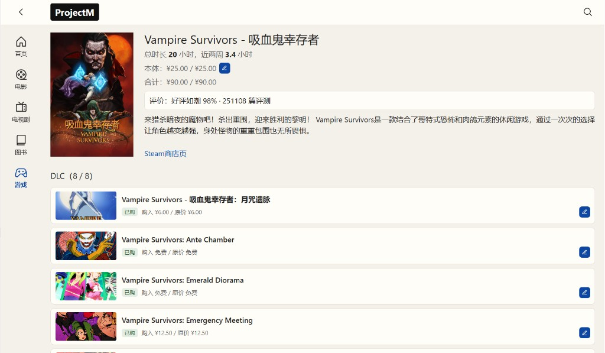

# projectM

> **本项目完全由 AI 生成。**  
> 当前版本 **0.0.1**

自己用的媒体记录站。电影、电视剧、图书、游戏：从正规资料库搜到条目，存一份快照，然后打分、写短评、标状态。

单用户，跑在你自己的机器上。体验接近豆瓣的「想看 / 在看 / 看过」，数据不来自豆瓣，也不爬小黑盒。

核心就这一圈：**搜 → 入库 → 自己记。** 一种作品一张 `Item`，你的记录一张 `Entry`。新类型只加 Provider，不另起一套表。

怎么在本机跑起来、Key 怎么填、换电脑怎么搬数据：见 [docs/DEPLOY.md](docs/DEPLOY.md)。

## 功能

侧栏五块：首页、电影、电视剧、图书、游戏。顶栏是返回、站名、当前类型的子标签，右边放大镜进搜索。

没有填某类 API Key 时，对应搜索会写明「未配置」，不会假装成功。

### 搜索与记录

顶栏放大镜打开 `/search`：选类型、输入关键词，从资料库搜，看中了就加入。已入库的会标出来。

加入之后可以改状态、打 0–10 分、写短评、填日期。电影、电视剧、图书共用同一套详情页。

| 类型 | 资料 | 状态文案 |
|------|------|----------|
| 电影 / 电视剧 | TMDB（中文名、海报、年份） | 想看 / 在看 / 看过 / 弃了 |
| 图书 | Google Books（书名或 ISBN） | 想读 / 在读 / 读过 / 弃了 |
| 游戏 | Steam | 想玩另记；玩过的主要看 Steam 时长和库存 |

### 电影、电视剧、图书

列表按子标签筛「全部」和四种状态。能搜、能加入、能打分写评。标签、片单、排序、手动添加还没有。

电视剧和电影共用一把 TMDB Key，暂不做季 / 集进度。图书文案是「图书」，不是「书」。

首页目前是占位。

### 游戏

游戏页接的是你的 Steam 号，不只是搜一条加一条。

资料卡：头像、名字、在线状态（在线 / 离线 / 游玩某某中只显示一个）、公开资料链接；下面是总游玩时长和库存价值（已付 / 原价）。迷你资料背景铺在卡上。卡右下角刷新只更新头像、状态、背景和等级，不拉库存。

资料卡右边：Steam 等级和经验条、库存 / 家庭库 / 完美通关 / 想玩的数量、近两周在玩的封面（最多五张）。右上角 **Update DB** 才向 Steam 拉整库并写入本地备份；右下角可以按名称筛当前列表。

子标签：

| 标签 | 内容 |
|------|------|
| 最近游玩 | 近两周有时长，且在账号库或家庭库 |
| 全部游玩 | 有时长的库存 / 家庭库游戏 |
| 完美通关 | 成就全部解锁的 |
| 库存游戏 | 账号库 |
| 家庭库 | 家庭库里有、账号库没有的 |
| 想玩 | 本地想玩，且还不在库里的 |

列表卡片统一：封面、标题、总时长、近两周、成就、购入价 / 原价。全成就有彩色边框。隐藏和私人游戏不出现在列表里。

点进详情可以看到时长、评价、简介、商店链接、DLC（可分别填购入价）、成就。购入合计按本体 + 已购 DLC 算。

有本地备份就只读备份；没有才拉一次 Steam 写入 `local/steam-cache.json`。之后切 tab、刷新页面都用这份备份。更新只在点 Update DB / 资料刷新，或连续 15 分钟没操作之后。Steam 连不上时也用备份。改了 token 要再点 Update DB。

## 原则

- 只走 TMDB、Google Books、Steam；不爬、不抓包、不走非官方代理
- 不镜像对方整库，只存你选中的快照和自己的记录
- 任何对外数据本地都有一份备份；没网也能看和改已有记录
- 默认不刷远程：用户点刷新、空闲 15 分钟、或本地还没有这份数据时才拉
- 不做账号、社交、推荐
- 代码保持直接：能一个模块说清的不要拆多层

进度和边界在 [docs/PLAN.md](docs/PLAN.md)。
